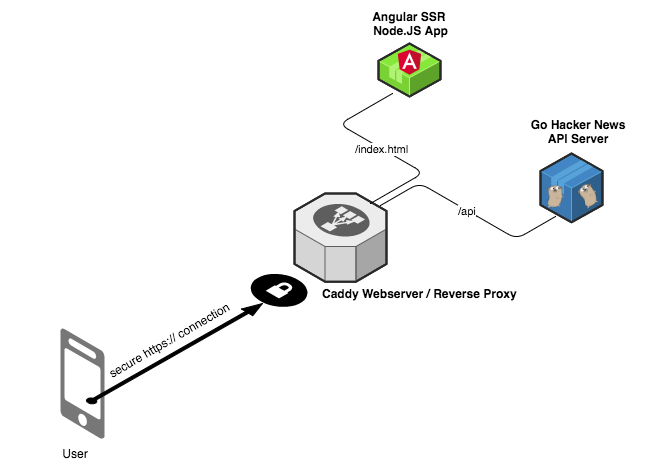
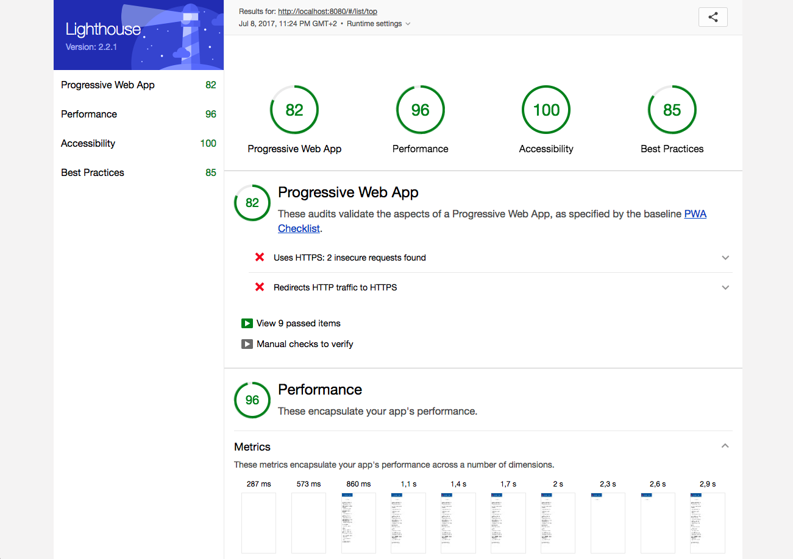

# Angular Hacker News PWA

**[SEE IT LIVE HERE!](https://angularhn.sebastian-mueller.net)**

A Hacker News clone / Progressive Web App (PWA) developed with Angular 4 for the [HNPWA](https://hnpwa.com/) project.

## Features
* **Framework/UI libraries:** Angular 4, Angular Router, Angular HTTP
* **Module bundling:** Webpack 3 with Scope Hoisting
* **Service Worker:** sw-precache
* **Performance patterns:** HTTP/2, Server Push, Brotli
* **Server-side rendering:** Yes with @angular/platform-server
* **API:** Hacker News Firebase API & Node-hnapi (unoffical)
* **Hosting:** Digitalocean / self-hosted
* **Other details:** Lazy loading of routes
* **Author:** [Sebastian Müller](https://github.com/SebastianM)

")

---

## Architecture

The application has 3 services that run in Docker containers on a [CoreOS Container Linux](https://coreos.com/products/container-linux-subscription/) in production.

[Caddy](https://caddyserver.com/) is used as fast webserver and reverse proxy. It serves all static assets (js, images, ...) as Brotli/Gzip files to achieve fast download times.

Current Lighthouse stats without HTTP2:

## Development
1. Install Yarn, Java SDK, Go 1.8, [Caddy](https://caddyserver.com/), and NodeJS 8
1. run `yarn --pure-lockfile`
1. run `yarn run build` or `npm run build`
1. run `caddy` in the root directory
1. run `node dist/src/server.js`
1. run `go run api.go`
1. open [http://localhost:8082](http://localhost:8082)

TODOS:
* CI configuration